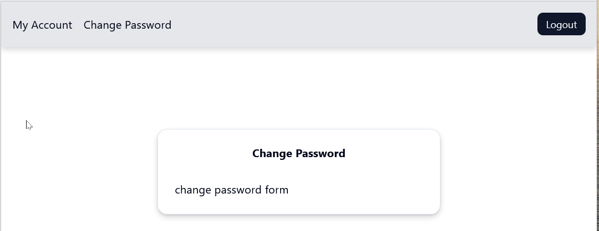
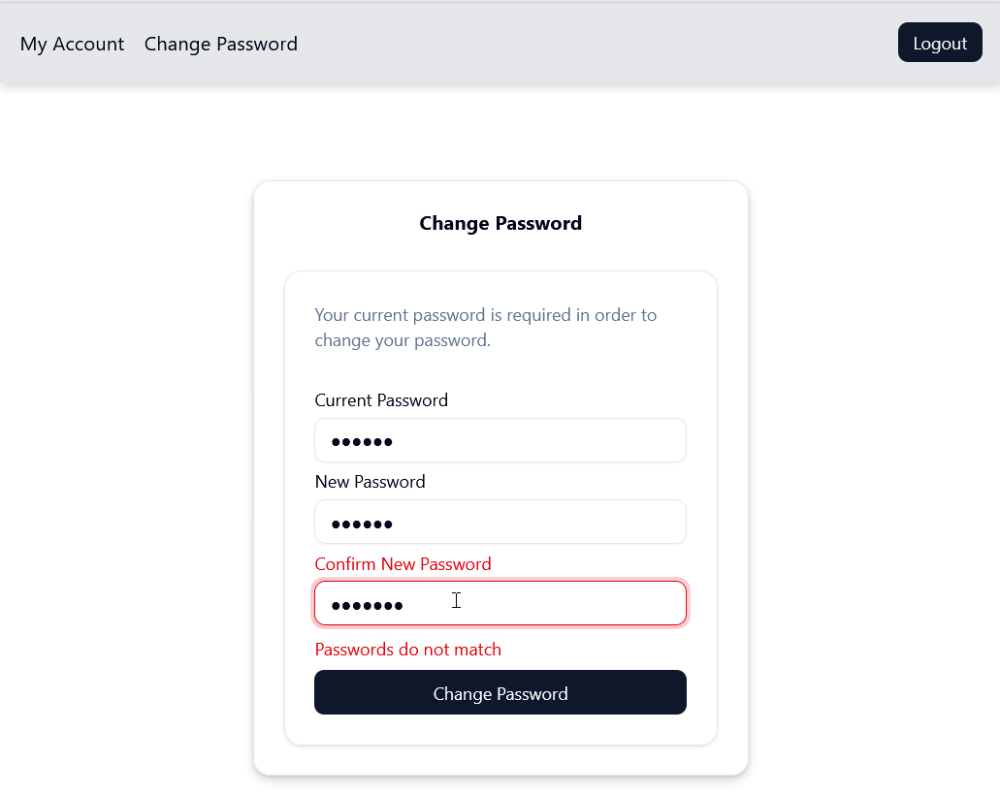

# Overview
With register and login forms completed, this markdown documents the creation of a Change Password form.

The implementation steps are:
1. Create client form component and test
2. Copy and modify form
3. Create server action component

# Step 1: Create Client Form And Test
1. Create new folder: `@/app/(logged-in)/change-password/change-password-form`
2. Create file inside this new folder named index.tsx with a default function of ChangePassword.

    ```tsx
    'use client';

    export default function ChangePasswordForm() {
      return <div>change password form</div>
    }
    ```
3. Create new page for the form in `@/app/(logged-in)change-password/page.tsx` with the following boilerplate code which includes the above client component.

    ```tsx
    import { Card, CardContent, CardHeader, CardTitle } from "@/components/ui/card";
    import ChangePasswordForm from "./change-password-form";

    export default function ChangePassword() {
      return (
        <Card className="w-[400]">
          <CardHeader>
            <CardDescription>Your current password is required in order to change your password.</CardDescription>
          </CardHeader>
          <CardContent>
            <ChangePasswordForm />
          </CardContent>
        </Card>
      )
    }
    ```
4. Save all and then run the *Change Password* link from the my-account page header. It should display a form card (shown below) ready for input fields.

    

# Step 2: Copy and Modify Form
It's easier to copy in the Register form and make adjustments to it for the password change. 

1. Copy the entire (second) `<Card>` element from `@/app/(logged-out)/register/page.tsx`, as well as the imports at the top of the file into the new form page at `@/app/(logged-in)/change-password/change-password-form/index.tsx`. 

2. Update the `<FormField>` elements to rename the one for email to be the current password field. When done the file should look like that shown below.

    ```tsx
      'use client';

      import z from "zod";
      import { passwordSchema } from "@/validation/passwordSchema";
      import { passwordMatchSchema } from "@/validation/passwordMatchSchema";
      import { zodResolver } from "@hookform/resolvers/zod";
      import { Card, CardContent, CardDescription, CardHeader, CardTitle, CardFooter } from "@/components/ui/card";
      import { Form, FormControl, FormField, FormItem, FormLabel, FormMessage } from "@/components/ui/form";
      import { Input } from "@/components/ui/input";
      import { Button } from "@/components/ui/button";
      import { useForm } from "react-hook-form";

      const formSchema = z.object({
        currentPassword: passwordSchema,
      }).and(passwordMatchSchema);


      export default function ChangePasswordForm() {
        const form = useForm<z.infer<typeof formSchema>>({
          resolver: zodResolver(formSchema),
          defaultValues: {
            currentPassword: "",
            password: "",
            passwordConfirm: ""
          }
        });

        // const [submitted, setSubmitted] = useState(false);
        const handleSubmit = async (data: z.infer<typeof formSchema>) => {};

        return (
          <Card className="w-[350]">
            <CardHeader>
              <CardDescription>Your current password is required in order to change your password.</CardDescription>
            </CardHeader>
            <CardContent>
              <Form { ...form }>
                <form onSubmit={ form.handleSubmit(handleSubmit) }>
                  <fieldset disabled={ form.formState.isSubmitting } className="flex flex-col gap-2">
                    <FormField
                      control={ form.control }
                      name="currentPassword"
                      render={ ({ field }) => (
                        <FormItem>
                          <FormLabel>Current Password</FormLabel>
                          <FormControl>
                            <Input { ...field } type="password" />
                          </FormControl>
                          <FormMessage />
                        </FormItem>
                      ) }
                    />
                    <FormField
                      control={ form.control }
                      name="password"
                      render={ ({ field }) => (
                        <FormItem>
                          <FormLabel>New Password</FormLabel>
                          <FormControl>
                            <Input { ...field } type="password" />
                          </FormControl>
                          <FormMessage />
                        </FormItem>
                      ) }
                    />
                    <FormField
                      control={ form.control }
                      name="passwordConfirm"
                      render={ ({ field }) => (
                        <FormItem>
                          <FormLabel>Confirm New Password</FormLabel>
                          <FormControl>
                            <Input { ...field } type="password" />
                          </FormControl>
                          <FormMessage />
                        </FormItem>
                      ) }
                    />
                    <Button type="submit">Change Password</Button>
                  </fieldset>
                </form>
              </Form>
            </CardContent>
          </Card>
          )
        }    
    ```
**Notes**:

- The form field validation is essentially the same as the Register form, except there is no email input. 
- The `<Fieldset>` element `name` attribute must match the typescript schema property names.
- The `handleSubmit` function is empty presently but at some point must invoke a `changePassword` function in the server action.
- If deployed this form will behave properly except the `handleSubmit` doesn't do anything. The validation should work, as shown below.



# Step 3: Create Server Action

In the same folder as the UpdatePasswordForm component, the server side component implements the changeUserPassword function shown below.

```tsx
'use server';

import { passwordMatchSchema } from "@/validation/passwordMatchSchema";
import z from "zod";
import { updateUserPassword, getUserByEmail } from "@/db/userQueries";
import { passwordSchema } from "@/validation/passwordSchema";
import { hashPasswordWithSalt } from "@/lib/hash";

export const changeUserPassword = async({
  email,
  currentPassword,
  password, 
  passwordConfirm}: {
    email: string, 
    currentPassword: string,
    password: string, 
    passwordConfirm: string
    }
  ) => {  

    try {
      const formSchema = z.object({
        currentPassword: passwordSchema
      }).and(passwordMatchSchema);
      
      const passwordValidation = formSchema.safeParse({currentPassword, password, passwordConfirm});
      if (!passwordValidation.success) {
        return {
          error: true,
          message: passwordValidation.error.issues[0]?.message ?? "An error occurred",
        };
      };

      /* The returnType below will return the current password and salt*/
      const returnType = await getUserByEmail(email);
      if (!returnType.success) {
        return {
          error: true,
          message: 'Unable to find user account'
        }
      }

      const hashedPassword = hashPasswordWithSalt(currentPassword, returnType.salt as string);
      if (hashedPassword !== returnType.password) {
        return {
          error: true,
          message: 'Current password is incorrect, guess again!'
        }
      }
      
      /* The async function will take care of hashing the new password (and new salt) */
      const updatedUser = await updateUserPassword(email, password);
      return {
        error:false,
        message: 'Password changed'
      };
    
    } catch (e: unknown) {
      if (e instanceof Error && e.code === "23505") {
        return {
          error: true,
          message: "An account is already registered with that email"
        };
      }
      return {
        error: true,
        message: "An unknown error occured."
      }
    }    
  };
  ```
**Notes**:

- Although it is a server-side component it could have retrieve the email property from the session variable. Overall, this approach might have been simpler than the way it was implemented.
  - The `@/app/(logged-in)/change-password/page.tsx` implements a `ChangeUserPassword` component and is passed the email from the session there. 
  - The `ChangeUserPassword` component is implemented in the `@/app/(logged-in)/change-password/change-password-form/index.tsx` file.

