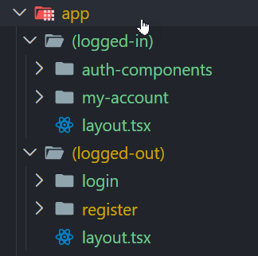
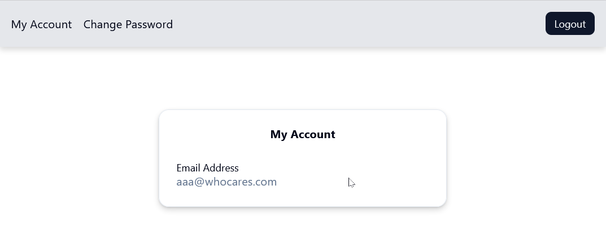

1. [Overview](#overview)
2. [Login Implemenation Steps Summary](#login-implemenation-steps-summary)
3. [Step 1: Create the Login Form and Server Action](#step-1-create-the-login-form-and-server-action)
   1. [Login Form](#login-form)
   2. [Server Action](#server-action)
4. [Step 2: Add Auth.js to Project](#step-2-add-authjs-to-project)
   1. [Next Auth vs. Auth.js](#next-auth-vs-authjs)
   2. [Add Auth.js to Project](#add-authjs-to-project)
5. [Step 3: Seed Initial Auth.js Files](#step-3-seed-initial-authjs-files)
6. [Step 4: Configure Credentials Provider](#step-4-configure-credentials-provider)
   1. [Configure auth.ts Provider](#configure-authts-provider)
   2. [Configure auth.ts Callbacks](#configure-authts-callbacks)
7. [Step 5: Create Route Groups and Layouts](#step-5-create-route-groups-and-layouts)
8. [Step 6: Create Logout Server Function](#step-6-create-logout-server-function)
9. [Step 7: Login Form Session signIn](#step-7-login-form-session-signin)
10. [Step 8: Implement Temporary Session Logic](#step-8-implement-temporary-session-logic)
11. [Step 9: Implement Page Protection](#step-9-implement-page-protection)
12. [Step 10: Backout Temporary Test Session Logic](#step-10-backout-temporary-test-session-logic)
13. [Step 11: Embellish the my-account Page](#step-11-embellish-the-my-account-page)

---
# Overview
This implementation guide logically follows the implementation of the [user registration form](./Implement-Register-Form.md). Make sure the registration form is able to register a user email and password into the users table. This guide assumes this part of the application works as this guide will document setting up the user login form (shown below) which entails: 

- Retrieving the user credentials from the users table
- Validating the password and use Auth.js to then establish an authorization session. 
- It assumes the user has already registered their email and hashed password via the registration process. 


# Login Implemenation Steps Summary
Implementing the Auth.js security for a credential provider is tedious, arguably involving more work than an Oauth implementation.

1. Create the login form and server action
2. Add Auth.js to the project
3. Seed Various Auth.js Files
4. Configure the Credentials provider
5. Create app route groups and layouts
6. Create a Logout server function
7. Add Auth.js to Login form Server Actions
8. Implement temporary test Session logic
9. Implement page protection
10. Backout Temporary test Session logic
11. Embellish the my-account Page

# Step 1: Create the Login Form and Server Action
Much of what was done for the register account form can be duplicated to create the login page functionality. The login functionality will:

## Login Form

- include the server action file import (to be created below)
- Remove the confirmPassword field from the form.

```tsx
'use client';

import { Card, CardContent, CardDescription, CardHeader, CardTitle, CardFooter } from "@/components/ui/card";
import { Form, FormControl, FormField, FormItem, FormLabel, FormMessage } from "@/components/ui/form";
import { Input } from "@/components/ui/input";
import { Button } from "@/components/ui/button";
import { useForm } from "react-hook-form";
import { zodResolver } from "@hookform/resolvers/zod";
import { z } from 'zod';
import Link from "next/link";
import { passwordSchema } from "@/validation/passwordSchema";
import { loginUser } from "./actions";
import { useRouter } from "next/navigation";

const formSchema = z
  .object({ email: z.email(), password: passwordSchema });

export default function Login() {
  const router = useRouter();
  const form = useForm<z.infer<typeof formSchema>>({
    resolver: zodResolver(formSchema),
    defaultValues: {
      email: "",
      password: ""
    },
  });
    const handleSubmit = async (data: z.infer<typeof formSchema>) => {
    const response = await loginUser({
      email: data.email,
      password: data.password
    });

    if (response?.error) {
      form.setError("root", {
        message: response?.message,
      });
    }
    else {
      router.push('/my-account');
    }
  };

  return (
    <main className="flex justify-center items-center min-h-screen">
      <Card className="w-[350px]">
        <CardHeader>
          <CardTitle>Login</CardTitle>
          <CardDescription>Login to your account.</CardDescription>
        </CardHeader>
        <CardContent>
          <Form { ...form }>
            <form onSubmit={ form.handleSubmit(handleSubmit) }>
              <fieldset disabled={ form.formState.isSubmitting } className="flex flex-col gap-2">
                <FormField
                  control={ form.control }
                  name="email"
                  render={ ({ field }) => (
                    <FormItem>
                      <FormLabel>Email</FormLabel>
                      <FormControl>
                        <Input { ...field } type="email" />
                      </FormControl>
                      <FormMessage />
                    </FormItem>
                  ) }
                />
                <FormField
                  control={ form.control }
                  name="password"
                  render={ ({ field }) => (
                    <FormItem>
                      <FormLabel>Password</FormLabel>
                      <FormControl>
                        <Input { ...field } type="password" />
                      </FormControl>
                      <FormMessage />
                    </FormItem>
                  ) }
                />
                { !!form.formState.errors.root?.message &&
                  <FormMessage>
                    { form.formState.errors.root.message }
                  </FormMessage>

                }
                <Button type="submit">Login</Button>
              </fieldset>
            </form>
          </Form>
        </CardContent>
        <CardFooter className="flex-col gap-2">
          <div className="text-muted-foreground text-sm">
            Don&apos;t have an account?{ "   " }
            <Link href="/register" className="underline">
              Register
            </Link>
          </div>
          <div className="text-muted-foreground text-sm">
            Forgot password?{ "   " }
            <Link href="/forgot" className="underline">
              Reset password
            </Link>
          </div>
        </CardFooter>
      </Card>
    </main>
  )
}
```
**Notes***:

- `shadcn` components installed in the `@/components/ui` directory are used extensively.

- Although the UI components clutter the above code block, it is the `handleSubmit` function that is more important.
  - The `loginUser` function resides in the server `actions.ts` file and its job is to validate the the user exists in the users table. 
  - If the user is registered in the users table then confirm the password is correct. 
  - If the user does not exist or the password is incorrect then an error is returned and shown on the login form.

## Server Action
The `@/app/(logged-in)/login/actions.ts` file will simply validate the input provided in the credentials conforms to the schema. The validation that the user is in fact registered in the users table and that the password matches is a validation performed in the `@/auth.ts` file [covered further down in the document](#configure-authts-provider).

```tsx
'use server';

import z from "zod";
import { passwordSchema } from "@/validation/passwordSchema";
import { signIn } from "@/auth"; /* Used by commented code at end of this file */

export const loginUser = async({
  email, 
  password}: {
    email: string,
    password: string
    }
  ) => {
    const userSchema = z.object({
      email: z.email(),
      password: passwordSchema
    });
    
    const userValidation = userSchema.safeParse({email, password});
    if (!userValidation.success) {
      return {
        error: true,
        message: userValidation.error.issues[0]?.message ?? "An error occurred in validation",
      };
        
      }
      /* uncomment code below after auth.ts is configured in Step 4: Configure the Credentials provider */
      /*
      try {
        console.info('Starting Credentails signIn...');
        await signIn("credentials", {
          email,
          password,
          redirect: false
        })
        console.info('Finished Credentails signIn...');
      } catch(e) {
        return {
          error: true,
          message: "Incorrect email or password"
        }
    };  
    */  
  }
  ```
**Notes**:

- Zod validation for email schema is defined by its type. Additional Zod validation is provided by the `@/validation/passwordSchema.ts` file.
- The `safeParse` method provides a return boolean that indicates whether an error occurred. (The `parse` method will throw an error.) 
- At the end of the file is code that is activated **after** the auth.ts Proivder is configured, as it provides access to the `signIn` function of NextAuth.

# Step 2: Add Auth.js to Project
Before going through the installation steps, let's clarify some of the naming in use with Auth.js.

## Next Auth vs. Auth.js
There is a lot of confusion about the Auth naming. 

-The older Auth library is [Next Auth.js](https://next-auth.js.org/) while the newer one (used here) is [Auth.js](https://authjs.dev/). 

The same authors who developed Next Auth also developed Auth.js, simplifying and expanding it to incorporate more platforms.

To complicate matters, **`Auth.js` is now maintained by the `Better Auth`**. The Better Auth team will provide patches to it but consider the Better Auth solution as the path forward. However, out of the box, Auth.js is well established and contains a larger number of OAuth providers, so we're going with Auth.js, not Better Auth.

## Add Auth.js to Project
For more info about the Getting Started page for Auth.js, [visit this page](https://authjs.dev/getting-started/installation?framework=Next.js). It explains how to install and setup Auth.js. However, we'll perform the steps below.

1. Run the npm install command: `npm install next-auth@beta` 

    **Note**: By *beta* it simply means v5 of next-auth, which is the Auth.js for Next.js. Confused?

2. The environment setup creates an AUTH_SECRET variable: `npx auth secret` 

   **Note**: The CLI above updates the `.env.local` file.

# Step 3: Seed Initial Auth.js Files

1. Add an `@/auth.ts` file with the following boilerplate content.

    ```tsx
    import NextAuth from "next-auth"
    
    export const { handlers, signIn, signOut, auth } = NextAuth({
      providers: [],
    })
    ```
2. Create `route.ts` file in the following new directory: `/app/api/auth/[...nextauth]` with the following content.

    ```tsx
    import { handlers } from "@/auth" 
    export const { GET, POST } = handlers
    ```
3. Create `@/proxy.ts` file with the following content (don't use the recommeded `middleware` naming  in the Getting Started setup).

    ```tsx
    export { auth as proxy } from "@/auth"
    ```

# Step 4: Configure Credentials Provider

The `Credentials` provider will be implement in this project (not Oauth). Fortunately Auth.js supports both credentials and OAuth schemes, so the library can be used for both. As shown below, the mouseover does strongly recommend against password authentication, favoring OAuth. 

---
**Caution**: The functionality provided for credentials-based authentication is intentionally limited to discourage the use of passwords due to the inherent security risks of the username-password model. 

OAuth providers spend significant amounts of money, time, and engineering effort to build. It is likely that your application would benefit from leveraging these battle-tested solutions rather than try to rebuild them from scratch.

- **abuse detection**: (bot-protection, rate-limiting)
- **password management**: (password reset, credential stuffing, rotation)
- **data security**: (encryption/salting, strength validation)
---

## Configure auth.ts Provider
To better explain the various parts of the Credentials configuration, the code below consists of various snippets that are appended to the code in the `auth.ts` file.

1. Add two imports to the `@/auth.ts` file.

    ```tsx
    import NextAuth from "next-auth";
    import Credentials from 'next-auth/providers/credentials';
    import { nextAuthUserByEmail } from "./db/userQueries";
    import { hashPasswordWithSalt } from "./lib/hash";
    ```
    **Note:** The last two imports are custom functions created to simplify the code in the Credentials provider configuration. Consult the following bookmark for more information on what they do.

2. **Append** the following `NextAuth` constructor that exposes four functions and defines an array of providers to be implemented in Auth.js. 

    ```tsx
    export const { handlers, signIn, signOut, auth } = NextAuth({
      providers: [],
      });
      ```
      **Note**: The `auth` function provides a way for the Next.js app to interact with NextAuth. Another function, 'signOut' allows a user to terminate their login session. (In auth.ts, simply mouseover the functions to get more documentation on what they do.)

3. **Append** the following Credentials configuration, **inside** the providers array. See the explanationatory notes after code block.

    ```tsx
      providers: [
        Credentials({
          /* See Note 1 */
          credentials: {
            email: {},
            password: {},
          },
          async authorize(credentials) {
            /* See Note 2 */
            const user = await nextAuthUserByEmail(credentials.email as string);

            if (!user) {
              throw new Error("user is null: Incorrect credentials");
            }
            else {
              /* See Note 3 */
              const hashedInputPassword = hashPasswordWithSalt(credentials.password as string, user.salt);
              const passwordCorrect = user.password === hashedInputPassword? true : false;
              if (!passwordCorrect) {
                throw new Error("Invalid credentials");
              }          
            }
            /* See Note 4 */
            return {
              id: user.id.toString(),
              email: user.email 
            }
          }
        })
      ]
    ```
      **Note 1**: Define requisite credentials schema. The empty object properties (e.g. `email: {}`), if NextAuth is to generate the form for the credentials. However, we're providing the form and Zod validation to do this.

      **Note 2**: Since a database is being used to persist user login data, a database select is perform inside the `authorize` method to retrieve the user credentials. Shown below is a snippet of the `nextAuthUserByEmail` function that does this.

      ```tsx
      export async function nextAuthUserByEmail(email: string)
        : Promise<{id: number, email: string, password: string, salt: string}> {
        const [user] = await db
          .select({
            id: users.id,
            email: users.email,
            password: users.password,
          })
          .from(users)
          .where(eq(users.email, email)); 
          
          if (user) {
            /* See Note 2A */
            const passwordParts = user.password.split(':');
        
            /* See Note 2B */
            const returnedUser = {
              id: user.id,
              email: user.email,
              password: passwordParts[0],
              salt: passwordParts[1]
          }
          return returnedUser;
        }
        /* The user object below is null but the provider logic in auth.ts will check for it */
        return user;
      }
      ```
      **Note 2A**: When the user password is stored in the users table, the password is stored with two parts: the **hashed password** and separate by a colon ("`:`"), the **salt string** used to hash the user password. The salt string is a randomly generated 16 byte string for each user.

      **Note 2B**: The `returnedUser` must contain the password and salt string so compare the incoming password can be hashed using the same salt before comparing the password credentials.

    **Note 3**: The hashing functions use the bcrypt library to do this. 
    - Both functions are shown below, where the first function was used when a user is initially registered. There you can see the two parts being appended to form the password that is then stored. 
    - The second function is used inside the auth.ts `authorize` method to hash the incoming password for validation purposes.

    ```tsx
    import crypto from 'node:crypto';

    export function hashUserPassword(password:string) {
      const salt = crypto.randomBytes(16).toString('hex');
      const hashedPassword = crypto.scryptSync(password, salt, 64);
      return hashedPassword.toString('hex') + ':' + salt;
    }

    export function hashPasswordWithSalt(password:string, salt: string) {
      const hashedPassword = crypto.scryptSync(password, salt, 64);
      return hashedPassword.toString('hex');
    }
    ```
    **Note 4**: The user object returned by the Credentials provider contains an `id` and `email` properties. **The id property (as a string) is important to create a JWT token for the authorization session**.

## Configure auth.ts Callbacks
More must be added to the NextAuth constructor however, to ensure the `id` property is properly initialized in the JWT token and sessions during `auth`, `signIn`, `signOut` callbacks.

1. Immediately above the `provider` array, add the following `callbacks` object with `jwt` and `session` configurations.

```tsx
  callbacks: {
    jwt({token, user}) {
      if (user) {
        token.id = user.id;
      }
      return token;
    },
    session({session, token}) {
        session.user.id = token.id as string;
        return session;
    }
  }, //end callbacks
```

2. Save the changes to the `auth.ts` file.

# Step 5: Create Route Groups and Layouts
Route groups provide the ability for pages to share layouts and are readily identified because the folder names within the `app` directory are enclosed in parentheses (e.g. `(logged-in)`, `(logged-out)`). As shown below there are two such route groups (presently).



The layout files provide a means to enforce login session rules. For example, all of the page.tsx files within the `(logged-in)` group require an authorization session. The snippet below resides in the `@/app/(logged-in)/layout-tsx` file. If there is no session, then redirect the user to the login page.

```tsx
...
export default async function LoggedInLayout({
  children,
}: {
  children: React.ReactNode
}) {
  const session = await auth();
  if (!session?.user?.id) {
    redirect("/login");
  }...}
  return (...)
```
# Step 6: Create Logout Server Function
Testing Auth.js at this point is not really feasible until several more things are implemented, like a logout function implemented for the `(logged-in)` pages. The invocation of the `logOut` function in auth.ts is defined in the `@/app/(logged-in)/auth-components` files. 

Since a logout button is a client function, the `index.ts` file provides this to run a server function to do the session logout in `actions.ts`. Both are shown below. 
   
   **index.ts**
   ```tsx
    'use client';

    import { Button } from "../../../components/ui/button";
    import { logout } from "./actions";

    export default function LogoutButton() {
      return (
        <Button size="sm" 
          onClick={ async () => {
            await logout();
          } 
        }>
        Logout
        </Button>
      )
    }   
  ```

  When the button `onClick` event fires, the `logout` function exported from `actions.ts` will run.

  **actions.ts**
  ```tsx
  'use server';

  import { signOut } from "@/auth";

  export const logout = async() => {
    await signOut();
  }  
  ```
# Step 7: Login Form Session signIn 
At the end of the `@/app/(logged-out)/login/actions.ts` file (as shown in [Step 1: Server Action](#server-action)) is code that needs to be uncommented (i.e. activated). The credentials validated in the `actions.ts` will now make a call to the `signIn` function exposed in the `auth.ts` file.     

# Step 8: Implement Temporary Session Logic
Enough has been done to this point such that we should test what we have thus far. However, we'll need some temporary code to help us troubleshoot. 

1. Open the root layout file (`@/app/layout.tsx`).
2. Add the following two imports.

    ```tsx
    import { auth } from "@/auth";
    import LogoutButton from "./(logged-in)/auth-components";
    ```
3. Just before the return, add the following variable creation.
   
   ```tsx
    const session = await auth();
   ```
4. Scroll down and rearrange the `{children}` prop display such that it is preceded by a conditional session display, as shown below.

    ```tsx
        ...
        <body className={ `${ geistSans.variable } ${ geistMono.variable } antialiased` }>
          <>
            <div>{ session?.user?.email ?
              <div><LogoutButton /> { session?.user?.email }</div>
              : "There is no session for the user" }</div>
            { children }
          </>
        </body>
        ...
    ```
4. Save and start the application: `npm run dev`

5. In the browser open URL: `http://localhost:3000/login`

6. Be patient debugging as there are a lot of moving parts.

# Step 9: Implement Page Protection
Use the authorization session created via the Credential provider implemented in auth.ts, add checks in the layout files to redirect the flow depending on the session state. 

Shown below is such a check in the `(logged-in)/layout.tsx` file.

```tsx
...
export default async function LoggedInLayout({
  children,
}: {
  children: React.ReactNode
}) {
  const session = await auth();
  if (!session?.user?.id) {
    redirect("/login");
  }
  return (...)}
```

The reverse logic is ustilized in the `(logged-out)/layout.tsx` file. If there is a session then redirect to the `(logged-in)/login/my-account` page.

```tsx
...
export default async function LoggedOutLayout({
  children,
}: {
  children: React.ReactNode
}) {
  const session = await auth();
  if (!!session?.user?.id) {
    redirect("/my-account");
  }
  return (...)}
```
# Step 10: Backout Temporary Test Session Logic
After testing various login and logout scenarios and you're confident in the results, return to the `root layout.tsx` file and remove the temporary logic that renders a logout button and email display.

# Step 11: Embellish the my-account Page
In this step we'll add a little embellishment the my-account page, before moving on to the [change password form implementation](./Change-Password-Form.md). 



Replace the page.tsx contents with the following.

```tsx
import { auth } from "@/auth";
import { Card, CardContent, CardHeader, CardTitle } from "@/components/ui/card";
import { Label } from "@/components/ui/label";

export default async function MyAccount() {
  const session = await auth();

  return (
    <Card className="w-[400] ">
      <CardHeader>
        <CardTitle className="text-center font-bold size-1.2">My Account</CardTitle>
      </CardHeader>
      <CardContent>
        <Label>
          Email Address
        </Label>
        <div className="text-muted-foreground">
          { session?.user?.email }
        </div>
      </CardContent>
    </Card>
  )
}
```