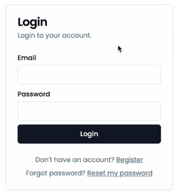

# Overview
This documentation logically follows the implementation of the [user registration form](./Implement-Register-Form.md). 

This markdown file will document setting up the user login form (shown below) which entails retrieving the user credentials from the users table, validating the password and use Next Auth to then establish an authorized session.  

# Copy Register to Login
Much of what was done for the register account form can be duplicated to create the login page functionality. The login functionality will:

- include the server action file, but remove the confirmPassword from all the references.

- The server action will retrieve the user from the database and show an error if not found. 

- Once the login form is behaving nicely then it is time to add the Auth.js library to the server action.

# Next Auth vs. Auth.js
There is a bit of confusion about the Auth naming. 

-The older Auth library is [Next Auth.js](https://next-auth.js.org/) while the newer one (used here) is [Auth.js](https://authjs.dev/). 

The same authors who developed the former also developed the latter, expanding it to incorporate more platforms.

