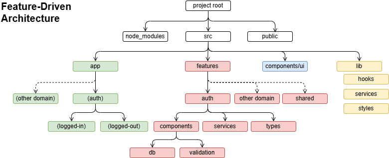

# Project Structure Overview 
This app is a working implementation of **Next.js** and **Auth.js** (or NextAuth v5) authentication. With authentication in place, the project can be used as a project boiler plate to seed a new application project, as most applications need authentication to start with. This project addresses the **auth** domain but leaves room for other domains (features) to be included.

# Table of Contents
To keep the implementation documentation at a digestible level, the various markdown files are provided.

- [New User Registration Form](./docs/HOWTO-1-Implement-Register-Form.md): Provide form to create initial credentials and `users` table
---
- [User Login Form](./docs/HOWTO-2-Implement-Login-Form.md): With user in table, provide a form to login, confirm password, and create session
---
- [Change Password Form](./docs/HOWTO-3-Change-Password-Form.md): Update the user password, requiring a current password.z
---
- [Reset Password Form](./docs/HOWTO-4-Reset-Password.md): Create token and store in `passwordResetTokens` table with expiration timestamp.
---
- [Use the Reset Token](./docs/HOWTO-5-UsingTheResetToken.md): Page will to receive token as a URL param and provide form to confirm/reset password.
---
- [Send Reset Password Email](./docs/HOWTO-6-SendingResetPasswordEmail.md): Email sent on password reset request to change password.
---
- [Setup Two-Factor Authentication](./docs/HOWTO-7-TwoFactorAuth.md): Steps to add 2FA for a user and once added, providing a way to remove it. 
---
- [Add 2FA steps to the Login process](./docs/HOWTO-8-Adding2FAtoLogin.md): Pretty involved steps to login a user who has set up two-factor auth.
---