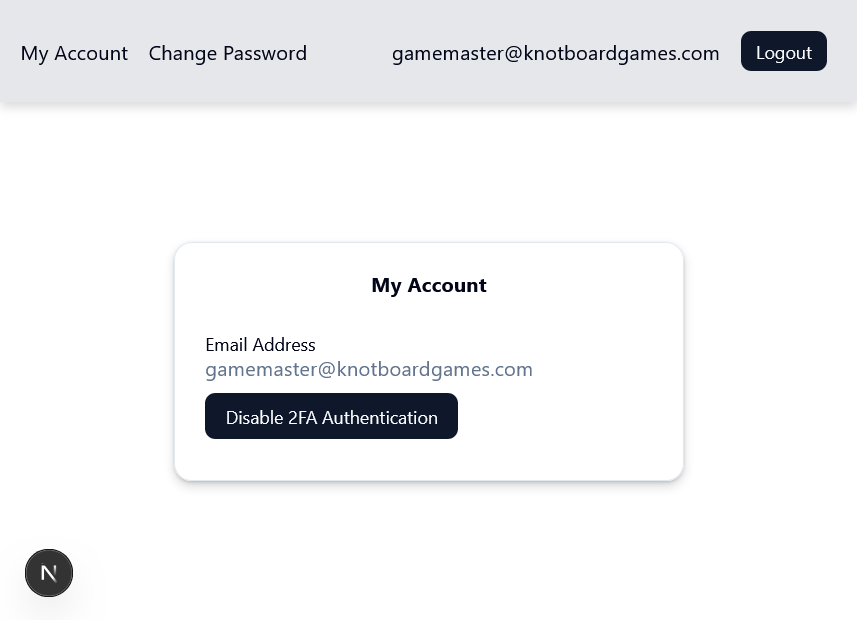

1. [Overview](#overview)
2. [Login Implemenation Steps Summary](#login-implemenation-steps-summary)
3. [Step 1: Create Route Groups and Layouts](#step-1-create-route-groups-and-layouts)
4. [Step 2: Create the Login Form and Server Action](#step-2-create-the-login-form-and-server-action)
   1. [Login Form Page](#login-form-page)
   2. [Login Form](#login-form)
   3. [Login Server Action](#login-server-action)
5. [Step 3: Add Auth.js to Project](#step-3-add-authjs-to-project)
   1. [Next Auth vs. Auth.js](#next-auth-vs-authjs)
   2. [Add Auth.js to Project](#add-authjs-to-project)
6. [Step 4: Seed Initial Auth.js Files](#step-4-seed-initial-authjs-files)
7. [Step 5: Configure Credentials Provider](#step-5-configure-credentials-provider)
   1. [Configure Credentials Provider](#configure-credentials-provider)
8. [Step 6: Implement Logout Functionality](#step-6-implement-logout-functionality)
   1. [Create Logout Client Component](#create-logout-client-component)
   2. [The Logout Server Action](#the-logout-server-action)
9. [Step 7: Implement Page Protection](#step-7-implement-page-protection)

---
# Overview
This How-To guide logically follows the implementation of the [user registration form](./Implement-Register-Form.md).  (See the [markdown index](../README-HowToGuides.md) for a list of all the How-To documents.)

Much of this How-To guide addresses the configuration of the NextAuth `@/auth.ts` file. The user functionality implemented encompasses only the email/password signIn and **does not address 2FA**. How-To guides 7 and 8 document the 2FA setup in the project.

- Retrieving the user credentials from the users table
- Validating the password and the use Auth.js to signIn functionality to establish an authorization session. (The link to reset the password is implemented in How-To guide 4.)

  

# Login Implemenation Steps Summary
Implementing the NextAuth security for a *credential provider* is tedious, arguably involving more work than an Oauth implementation. Baby steps!

1. Create app route groups and layouts
2. Create the login form and server action
3. Add Auth.js to the project
4. Seed Various Auth.js Files
5. Configure the Credentials provider
6. Create app route groups and layouts
7. Create a Logout server function
8. Add Auth.js to Login form Server Actions
9. Implement temporary test Session logic
10. Implement page protection
11. Backout Temporary test Session logic
12. Embellish the my-account Page

# Step 1: Create Route Groups and Layouts
The application routes are going to fall into one of two categories: logged in or logged out. As such, route groups can be used as they provide the ability for pages to share layouts and are readily identified because the folder names within the `app` directory are enclosed in parentheses (e.g. `(logged-in)`, `(logged-out)`).


**Note**: *The login functionality falls into the (logged-out) app route.*


The layout files provide a means to enforce login session rules. For example, all of the page.tsx files within the `(logged-in)` group require an authorization session. The snippet below resides in the `layout-tsx` file. If there is no session, then redirect the user to the login page.

**source file**: *`@/app/(auth)/(logged-in)/layout-tsx`*

```tsx
...
export default async function LoggedInLayout({
  children,
}: {
  children: React.ReactNode
}) {
  const session = await auth();
  if (!session?.user?.id) {
    redirect("/login");
  }...}
  return (...)
```


# Step 2: Create the Login Form and Server Action
The main points of the Login form and its associated server actions are shown as snippets here, to point out the more important parts.

## Login Form Page
Much of what was done for the Register account form can be duplicated to create the login page functionality.

**source file**: *`@/app/(auth)/(logged-out)/login/page.tsx`*

```tsx
  'use client';

  /* Note 1 */
  import LoginForm from "./login-form";

  export default function Login() {
    /* Note 2 */
    return (
      <LoginForm />
    )
  }
```
**Notes**:

  -**Note 1**: *Every page that implements a form delegates that functionality to a separate `index.tsx` file in the form directory (e.g. `@/app/(auth)/(logged-out)/login-form/index.tsx`).*

  -**Note 2**: *The form itself contains all of the requisite client side components to validate the credentials. The actual login is performed by the `auth.ts` signIn interface which runs the authorize function [to be configured later)](#configure-authts-provider).*

## Login Form
The pattern to implement a form would require: a form directory that contains a client form component (`index.tsx`) and a server actions component (`actions.ts`) be used. Any server side components that need to be accessed are done in the server actions component.

**source file**: *`@/app/(auth)/(logged-out)/login/login-form/index.tsx`* <<< The is full-monty implementation. The snippet below is abbreviated.

```tsx
  ...
  export default function LoginForm() {
    /* NOTE 1 */
    const [email, setEmail] = useState(urlEmail);
    const [step, setStep] = useState(1);
    const [emailAuthError, setEmailAuthError] = useState("");
    const router = useRouter();

    const form = useForm<z.infer<typeof formSchema>>({
      resolver: zodResolver(formSchema),
      defaultValues: {
        email: email,
        password: ""
      },
    });
    /* NOTE 2 */
    const handleEmailSubmit = async (data: z.infer<typeof formSchema>) => {
      setEmail(data.email);
      const precheckResult = await emailLoginCheck({ email: data.email, password: data.password });

      if (precheckResult.error) {
        form.setError("root", {
          message: precheckResult.message,
        });
        setEmailAuthError(precheckResult.message ?? "")
        return;
      }

      /* NOTE 3 */
      if (precheckResult.isActive) {
        setStep(2);
      }
      else {
        const response = await fullLoginUser({
          email: data.email,
          password: data.password
        });

        if (response?.error) {
          form.setError("root", {
            message: response?.message,
          });
        }
        else {
          router.push('/my-account');
        }
      }
    };

    return (
      <main className="flex justify-center items-center min-h-screen">
        { step === 1 &&
          <Card className="w-[350]">
            <CardHeader>
              <CardTitle>Login</CardTitle>
              <CardDescription>Login to your account.</CardDescription>
            </CardHeader>
            <CardContent>
              <Form { ...form }>
                { "NOTE 4" }
                <form onSubmit={ form.handleSubmit(handleEmailSubmit) }>
                  <fieldset disabled={ form.formState.isSubmitting } className="flex flex-col gap-2">
                    <FormField
                      control={ form.control }
                      name="email"
                      render={ ({ field }) => (
                        <FormItem>
                          <FormLabel>Email</FormLabel>
                          <FormControl>
                            <Input { ...field } type="email" />
                          </FormControl>
                          <FormMessage />
                        </FormItem>
                      ) }
                    />
                    <FormField
                      control={ form.control }
                      name="password"
                      render={ ({ field }) => (
                        <FormItem>
                          <FormLabel>Password</FormLabel>
                          <FormControl>
                            <Input { ...field } type="password" />
                          </FormControl>
                          <FormMessage />
                        </FormItem>
                      ) }
                    />
                    { !!emailAuthError &&
                      <FormMessage>
                        { emailAuthError }
                      </FormMessage>
                    }
                    <Button type="submit">Login</Button>
                  </fieldset>
                </form>
              </Form>
            </CardContent>
            <CardFooter className="flex-col gap-2">
              <div className="text-muted-foreground text-sm">
                Don&apos;t have an account?{ "   " }
                <Link href="/register" className="underline">
                  Register
                </Link>
              </div>
              <div className="text-muted-foreground text-sm">
                Forgot password?{ "   " }
                { "NOTE 5" }
                <Link className="underline"
                  href={ `/password-reset${ form.getValues("email") ? `?email=${ encodeURIComponent(form.getValues("email")) }` : "" }` }>
                  Reset my password
                </Link>
              </div>
            </CardFooter>
          </Card>
        }
        { " NOTE 6" }
        { step === 2}
      </main>
    )
  }
```
**Notes**: 

  - **Note 1**: *State is needed to manage the login process, specifically the `step` variable that is used to advanced from the email/password login (step 1) to an optional step 2 which prompts for a one-time passcode if they enabled 2FA.*

  - **Note 2**: *The step 1 form submission runs the `emailLoginCheck` server-side actions function to validate the email/password credentials. If valid then the step is set to 2, which only runs if they enabled 2FA.*

  - **Note 3**: *The `precheckResult.isActive` indicates whether 2FA is enabled or not.*

  - **Note 4**: *This is the first of two form submissions, the 2nd submit is for 2FA and optional.*

  - **Note 5**: *This bit of script will pass the email address on in the event they entered it but now want click on the link to reset their password. I was not successful getting this to work on a `<Link>`. It works on a `router.push(...)` however.*

  - **Note 6**: *Step 2 (which is truncated here) is the optional step to prompt for a One-Time Passcode (OTP) to finalize the login.* 

## Login Server Action
The server actions file will validate the input provided in the credentials conforms to the schema. The validation that the user is in fact registered in the users table and that the password matches is a validation performed via the `signIn` function exposed in the `@/auth.ts` file.

**source file**: *`@/app/(auth)/(logged-out)/login/login-form/actions.ts`*

```tsx
  'use server';

  /* NOTE 1 */
  export const fullLoginUser = async({email, password, token}
  : {email: string, password: string, token?: string}) => {
      const userSchema = z.object({
        email: z.email(),
        password: passwordSchema
      });
      /* NOTE 2 */
      const userValidation = userSchema.safeParse({email, password});
      if (!userValidation.success) {
        return {
          error: true,
          message: userValidation.error.issues[0]?.message ?? "An error occurred in validation",
        };
          
        }
        /* NOTE 3 */
        try {
          const signInResult = await signIn("credentials", {
            email,
            password,
            token, 
            redirect: false
          })
        } catch(e) {
          return {
            error: true,
            message: "Incorrect email or password"
          }
      };    
    };
  ```

**Notes**:

- **Note 1**: *Zod validation for email schema is defined by its type and the password authentication is specified in the `@/validation/passwordSchema.ts` file. **Ignore the token argument here** as this is used when the 2FA OTP is passed in.*
- **Note 2**: *The `safeParse` method returns a boolean that indicates whether there was a content error in the credentials. (The `parse` method throws an error so it's not used here.)* 
- **Note 3**: *The `signIn` method is exposed in the Credentials provider configured in the auth.ts. The credentials validation here is focused on the email/password but later the OTP `token` is passed.*

# Step 3: Add Auth.js to Project
Before going through the installation steps, let's clarify some of the naming in use with Auth.js.

## Next Auth vs. Auth.js
There is a lot of confusion about the Auth naming. 

-The older Auth library is [Next Auth.js](https://next-auth.js.org/) while the newer one (used here) is [Auth.js](https://authjs.dev/). 

The same authors who developed Next Auth also developed Auth.js, simplifying and expanding it to incorporate more platforms.

To complicate matters, **`Auth.js` is now maintained by the `Better Auth`**. The Better Auth team will provide patches to it but consider the Better Auth solution as the path forward. However, out of the box, Auth.js is well established and contains a larger number of OAuth providers, so we're going with Auth.js, not Better Auth.

## Add Auth.js to Project
For more info about the Getting Started page for Auth.js, [visit this page](https://authjs.dev/getting-started/installation?framework=Next.js). It explains how to install and setup Auth.js. However, we'll perform the steps below.

1. Run the npm install command: `npm install next-auth@beta` 

    **Note**: By *beta* it simply means v5 of next-auth, which is the Auth.js for Next.js. Confused?

2. The environment setup creates an AUTH_SECRET variable: `npx auth secret` 

   **Note**: The CLI above updates the `.env.local` file.

# Step 4: Seed Initial Auth.js Files
It's a good idea to get acquainted with the [Auth.js documentation for credentials authentication](https://authjs.dev/getting-started/authentication/credentials). 

1. Add an `@/auth.ts` file with the following boilerplate content. 

    **Note** *Trust me, a lot more will be added to this file in steps below.*

    ```tsx
      import NextAuth from "next-auth"
      
      export const { handlers, signIn, signOut, auth } = NextAuth({
        providers: [],
    })
    ```
2. Create `route.ts` file in the following new directory: `@/app/api/auth/[...nextauth]` with content below.

    ```tsx
      import { handlers } from "@/auth" 
      export const { GET, POST } = handlers
    ```

    **Note**: *The `handlers` are Auth.js functions that process authentication-related HTTP requests, like GET and POST, defined here for Next.js app routing.*

3. Create `@/proxy.ts` file with the following content.

    ```tsx
    export { auth as proxy } from "./auth"
    ```
  **Note**: *The documentation still references the `middleware` proxy but this is deprecated. Instead, use `proxy`.*

# Step 5: Configure Credentials Provider

The `Credentials` provider will be implement in this project (not Oauth). Fortunately Auth.js supports both credentials and OAuth schemes, so the library can be used for both. As shown below, the mouseover does strongly recommend against password authentication, favoring OAuth. 

---
**Caution**: The functionality provided for credentials-based authentication is intentionally limited to discourage the use of passwords due to the inherent security risks of the username-password model. 

OAuth providers spend significant amounts of money, time, and engineering effort to build. It is likely that your application would benefit from leveraging these battle-tested solutions rather than try to rebuild them from scratch.

- **abuse detection**: (bot-protection, rate-limiting)
- **password management**: (password reset, credential stuffing, rotation)
- **data security**: (encryption/salting, strength validation)
---

## Configure Credentials Provider
The fully implemented NextAuth `auth.ts` file is shown below. Important Notes follow the code block to describe various features of it.

**source file** *`@/auth.ts`*

```tsx
  import NextAuth from "next-auth";
  import Credentials from 'next-auth/providers/credentials';
  import { authValidation } from "./features/auth/services/auth-utils";

  /* NOTE 1 */
  type AuthRecord = {
    email: string;
    password: string;
    token?: string;
  }
  /* NOTE 2 */
  export const { handlers, signIn, signOut, auth } = NextAuth({
    callbacks: {
      jwt({token, user}) {
        if (user) {
          token.id = user.id;
        }
        return token;
      },
      session({session, token}) {
          session.user.id = token.id as string;
          return session;
      }
    }, //end callbacks
    /* NOTE 3 */
    providers: [
      Credentials({
        credentials: {
          email: {},
          password: {},
          token: {},
        },
        /* NOTE 4 */
        async authorize(credentials) {
          const userEmail = credentials.email;
          const userPassword = credentials.password;
          const token = credentials.token;

          const authRecord:AuthRecord = {
            email: userEmail as string,
            password: userPassword as string,
            token: token as string,
          };
          /* NOTE 5 */
          const validationResult = await authValidation(authRecord);

          if (validationResult.error) {
            return null;
          }
          return  validationResult;      
        }
      })
    ],
  });
```
**Notes**:

  - **Note 1**: *The input arguments support both email/password credentials as well as 2FA. Presently this guide is not addressing 2FA. (See guides 7-8 for info on the 2FA login.*

  - **Note 2**: *The `NextAuth` constructor has two configurations: the first for the callbacks and the second for the Credentials authorize.*
    - The JWT callback needs the authorization `id` (as a string) in order to generate a `jwt` token for the validated session, which consists of the `user.id`.
    - The `session` object created must also include the `user.id` as well, so it is added to the session object.

  - **Note 3**: *The providers configuration is an array. In this implementation is focused on the `Credentials` provider but one or more OAuth providers could be (usually are) configured as well.*

  - **Note 4**: *The `authorize` function is executed when the `signIn` callback method is called by our login actions component.*

  - **Note 5**: *The `authValidation` function is a common routine performed.* 

# Step 6: Implement Logout Functionality
When a user has logged in, a button to logout must be provided. This is implemented in the `layout.tsx` defined for the `@app/(logged-in)` pages, as shown below.



**Note**: *The invocation of the `logOut` function in auth.ts is defined in the `@/app/(logged-in)/auth-components` files.*

## Create Logout Client Component
The client button to implement the logout is shown below. 
   
  **source file**: *`@/app/(auth)/(logged-in)/auth-components/index.tsx`* 

  ```tsx
    'use client';

    import { Button } from "@/components/ui/button";
    import { logout } from "./actions";

    export default function LogoutButton() {
      return (
        <Button size="sm" 
          onClick={ async () => {
            await logout();
          } 
        }>
        Logout
        </Button>
      )
    }   
  ```
## The Logout Server Action
  When the button `onClick` event fires, the `logout` function exported from `actions.ts` will run. In turn, it executes the `signOut` function configured in `auth.ts`. Say bye-bye authentication session!

  **source file**: *`@/app/(auth)/(logged-in)/auth-components/actions.ts`* 

  ```tsx
    'use server';

    import { signOut } from "@/auth";

    export const logout = async() => {
      await signOut();
    }  
  ```

# Step 7: Implement Page Protection
Use the authorization session created via the Credential provider implemented in auth.ts, add checks in the layout files to redirect the flow depending on the session state. 

Shown below is such a check in the `(logged-in)/layout.tsx` file.

```tsx
...
export default async function LoggedInLayout({
  children,
}: {
  children: React.ReactNode
}) {
  const session = await auth();
  if (!session?.user?.id) {
    redirect("/login");
  }
  return (...)}
```

The reverse logic is utilized in the `(logged-out)/layout.tsx` file. If there is a session then redirect to the `(logged-in)/login/my-account` page.

```tsx
...
export default async function LoggedOutLayout({
  children,
}: {
  children: React.ReactNode
}) {
  const session = await auth();
  if (!!session?.user?.id) {
    redirect("/my-account");
  }
  return (...)}
```
