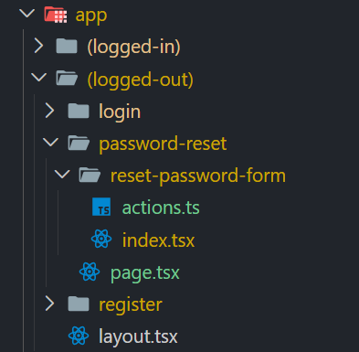

1. [Overview](#overview)
2. [Step 1: Create App Route Directories](#step-1-create-app-route-directories)
3. [Step 2: Pass Email Entered on Login Page](#step-2-pass-email-entered-on-login-page)
4. [Step 3: Define page.tsx and index.tsx Content](#step-3-define-pagetsx-and-indextsx-content)
   1. [The Reset Password Page](#the-reset-password-page)
   2. [The ResetPasswordForm Component](#the-resetpasswordform-component)
5. [Step 4: Create the Password Reset Tokens Table](#step-4-create-the-password-reset-tokens-table)
6. [Step 5: Create Insert into passwordResetTokens Table](#step-5-create-insert-into-passwordresettokens-table)
7. [Step 6: Create Reset Password Server Actions Component](#step-6-create-reset-password-server-actions-component)
8. [Step 7: Implement the Server Action Component](#step-7-implement-the-server-action-component)

# Overview
This How-to guide documents how to create a form to send a password reset URL to the user and provide the form to reset it. (See the [markdown index](../README-HowToGuides.md) for a list of the How-To documents and their purpose.)

This functionality will be implemented inside the `@/app/(auth)/(logged-out)/password-reset` route.


The steps to be followed to implement the above form, send email and create the reset password are summarized below. More detail will follow for each.

1. Create app route directories.
2. Pass login form email address to reset form email address.
3. Define content for `page.tsx` and `index.tsx` files. 
4. Create the password_reset_tokens table.
5. Create logic to insert into `passwordResetTokens` table.
6. Create server actions component (`actions.ts`) to validate Password Reset.
7. Implement the server action component.


# Step 1: Create App Route Directories
From the app directory you can see the folders and files that were created under `@/app/(auth)/(logged-out)/password-reset` to encapsulate the reset password functionality. It assumes the user is logged out and wants to have it reset.


   
# Step 2: Pass Email Entered on Login Page
If the user is on the login page and tried to login but failed, they but they can click on the reset password link on the form. The email address they entered should be carried over to the password reset form.

In the login page, update the reset password `<Link>` to set the following fairly tricky `href`.

  **source file**: *`@/app/(auth)/(logged-out)/login/page.tsx`*

  ```tsx
    ...
      <div className="text-muted-foreground text-sm">
        Forgot password?{ "   " }
        <Link 
          href={`/password-reset${
            email ? `?email=${encodeURIComponent(email)}` 
                  : ""
          }`} 
          className="underline">
          Reset my password
        </Link>
      </div>
    ...
  ```

**Note**: *After making the aforementioned changes entering a value in the email form field was not captured, the email variable was an empty string. The issue is there was no content being rendered by simply entering an email. The solution then is to use the React state hook to capture the email.*

3. Enter the following `useState` hook At the top of the `Login` component.

    ```tsx
      export default function Login() {
        const [emailValue, setEmailValue] = useState("");
    ```

5. Add an event handler function to capture the email form input value and to set the state variable.

    ```tsx
      function handleEmailChange(e) {
        setEmailValue(e.target.value);
      }
    ```

6. Scroll down and modify the `<Input>` for the email form field to that shown below.

    ```tsx
    ...
      <FormControl>
        <Input { ...field } type="email" onChange={ handleEmailChange } value={ emailValue } />
      </FormControl>
    ...
    ```
# Step 3: Define page.tsx and index.tsx Content
The two files described here represent the client components to render the `ResetPassword` and `ResetPasswordForm` components.

## The Reset Password Page
As shown in the *snippet* below (refer to the full file if necessary), when rendered this page will include the reset password form. 

**Note**: *The reset password form could have been included in the page.tsx file. As a best practice however, the form is relegated to a separate file, using the name `index.tsx`.*

  **source file**: *`@/app/(auth)/(logged-out)/password-reset/page.tsx`*

  ```tsx
    import { Card, CardContent, CardDescription, CardHeader, CardTitle } from "@/components/ui/card";
    import ResetPasswordForm from "./reset-password-form";

    export default function ResetPassword() {
      return (
        <main className="flex justify-center items-center min-h-screen">
          <Card className="w-[350]">
            <CardHeader>
              <CardTitle className="text-center font-bold size-1.2">Reset Password</CardTitle>
              <CardDescription>Enter your email address to reset your password.</CardDescription>
            </CardHeader>
            <CardContent>
              <ResetPasswordForm />
            </CardContent>
          </Card>
        </main>
      )
    }
  ```
## The ResetPasswordForm Component
The `index.tsx` file implements a client form component, the associated (Zod) validation and the form submission, implemented in the `actions.ts` file.

  **source file**: *`@/app/(auth)/(logged-out)/password-reset/page.tsx`*

  ```tsx
    'use client';

    import z from "zod";
    import { zodResolver } from "@hookform/resolvers/zod";
    import { Form, FormControl, FormField, FormItem, FormLabel, FormMessage } from "@/components/ui/form";
    import { Input } from "@/components/ui/input";
    import { Button } from "@/components/ui/button";
    import { useForm } from "react-hook-form";
    import { toast } from "sonner";
    import { CardFooter } from "@/components/ui/card";
    import Link from "next/link";
    import { useSearchParams } from "next/navigation";

    const formSchema = z.object({
      email: z.email()
    });

    export default function ResetPasswordForm() {
      /* Note 1 */
      const searchParams = useSearchParams();

      const form = useForm<z.infer<typeof formSchema>>({
        resolver: zodResolver(formSchema),
        /* Note 1 */
        defaultValues: {
          email: decodeURIComponent(searchParams.get("email") ?? ""),
        }
      });

      const handleSubmit = async (data: z.infer<typeof formSchema>) => {
        /* Note 2 */
      };

      return (
        <Form { ...form }>
          <form onSubmit={ form.handleSubmit(handleSubmit) }>
            <fieldset disabled={ form.formState.isSubmitting } className="flex flex-col gap-2">
              <FormField
                control={ form.control }
                name="email"
                render={ ({ field }) => (
                  <FormItem>
                    <FormLabel>Email Address</FormLabel>
                    <FormControl>
                      <Input { ...field } type="email" />
                    </FormControl>
                    <FormMessage />
                  </FormItem>
                ) }
              />
              { !!form.formState.errors.root?.message &&
                <FormMessage>
                  { form.formState.errors.root.message }
                </FormMessage>
              }
              <Button type="submit">Submit Password Reset</Button>
            </fieldset>
            <CardFooter className="flex flex-col gap-2">
              <div className="text-muted-foreground text-sm">
                Remember your password? { " " } <Link href="/login" className="underline">Login</Link>
              </div>
              <div className="text-muted-foreground text-sm">
                Register new account? { " " } <Link href="/register" className="underline">Register</Link>
              </div>
            </CardFooter>
          </form>
        </Form>
      )
    }
  ```
**Notes**:

   - **Note 1**: *The email default value provided to the Zod Javascript validation sets the email value to whatever was passed from the Login page, as discussed previously. If none passed the value is an empty string.*
   - **Note 2**: *The `handleSubmit` is left empty currently, to faciliate testing the login->reset form flow. When filled in, it will reference the `actions.ts` server component.*

# Step 4: Create the Password Reset Tokens Table
The new `passwordResetTokens` table will now be defined and pushed to the Neon PostgreSql platform.

1. Create the `schema-passwordResetTokens.ts` file with the following code to create the `passwordResetTokens` table.

    **source file**: *`@/features/auth/components/db/schema-passwordResetTokens.ts`*

    ```tsx
      import { serial, pgTable, text, timestamp, integer } from "drizzle-orm/pg-core";
      import {users} from "./usersSchema";

      export const passwordResetTokens = pgTable("password_reset_tokens", {
        id: serial("id").primaryKey(),
        userId: integer("user_id").notNull().references(() => users.id, {
          onDelete: "cascade"
        }).unique(),
        token: text("token").notNull(),
        tokenExpiry: timestamp("token_expiry"),
      });
    ```

2. Update the `@/features/auth/components/db/schema.ts` file to export the `passwordResetTokens` table. This file defines the two tables currently in use by the authentication feature. 

    ```tsx
      ...
      export { passwordResetTokens } from './schema-passwordResetTokens';
    ```
    **Note**: *The above `schema.ts` file is referenced in the `@/drizzle.config.ts` file which is used by the `npx push` command to update the schema on the Neon platform*.

3. Run in terminal window: `npx drizzle-kit push`

    ```bash
    PS C:\Users\ghughlett\Projects\udemy\next-auth-course\my-app> npx drizzle-kit push        
    No config path provided, using default 'drizzle.config.ts'
    Reading config file 'C:\Users\ghughlett\Projects\udemy\next-auth-course\my-app\drizzle.config.ts'
    [dotenv@17.2.3] injecting env (2) from .env.local -- tip: 🗂️ backup and recover secrets: https://dotenvx.com/ops
    Using 'pg' driver for database querying
    [✓] Pulling schema from database...
    [✓] Changes applied
    ```  
4. Go to the Neon website and confirm the new table's existence.

    

# Step 5: Create Insert into passwordResetTokens Table
The PostgreSql insert function `INSERT ON CONFLICT UPDATE` is in use here to handle the situation where the user makes multiple reset password requests. Since the entry in the `passwordResetTokens` table is unique per user, rather than failing, the newly minted token and expiry will be updated in the record.

Shown below is the `insertPasswordToken` function that performs the insert. 

**source file**: *@/db/queries-passwordResetTokens.ts*

```tsx
  "use server";

  import { passwordResetTokens } from './schema';
  import db from './drizzle';

  /* Note 1 */
  export type InsertRecordType = {
    userId: number;
    token: string;
    tokenExpiry: Date;
  }

  type InsertReturnType = {
    error: boolean,
    message?: string
  }

  export async function insertPasswordToken(arg: InsertRecordType)
  : Promise<InsertReturnType> {
    try {
      const result = await db.insert(passwordResetTokens).values({
        userId: arg.userId,
        token: arg.token,
        tokenExpiry: arg.tokenExpiry
      }).returning()
        .onConflictDoUpdate({
          target: passwordResetTokens.userId,
          set: {
            token: arg.token, 
            tokenExpiry: arg.tokenExpiry
          }
        });

      if (!result) {
        return {
          error: true,
          message: "Error inserting into passwordResetTokens table"
        }
      };

      /* Note 2 */
      return {
        error: false
      }
    }catch (e:unknown) {
        return {
          error: true,
          message: "Unknow error occured in the passwordResetTokens table"
        }
      }
    }
```
**Notes**:

  - **Note 1**: The `InsertReturnType` type is exported here so it can be imported and used in the `action.ts` file that will pass the object to be inserted.
  - **Note 2**: A good insert returns `error: false` which might be unnecessary but it provides consistency.

# Step 6: Create Reset Password Server Actions Component
You may have noticed the `handleSubmit` function shown before in the `index.tsx` is empty but it will be updated to call the `passwordReset` function shown below.

**source file**: *`@/app/(auth)/(logged-out)/password-reset/reset-password-form/actions.ts`*

```tsx
  'use server';
  import { auth } from "@/auth";
  import { getUserByEmail } from "@/features/auth/components/db/queries-users";
  import { randomBytes } from "crypto";
  import { insertPasswordToken } from "@/features/auth/components/db/queries-passwordResetTokens";
  import { InsertRecordType } from "@/features/auth/types/passwordResetTokens";

  export const passwordReset = async (email: string) => {
    /* Note 1 */
    const session = await auth();
    if (!!session?.user?.id) {
      return {
        error: true,
        message: "You are already logged in"
      }
    };
    /* Note 2 */
    const userInfo = await getUserByEmail(email);
    if (!userInfo.success) {
      return;
    }
    /* Note 3 */
    const passwordResetToken = randomBytes(32).toString('hex');
    const tokenExpiry = new Date(Date.now() + 3600000); //3.6M ms is 1 hour
    const insertRecord: InsertRecordType = {
      userId: userInfo.id as number,
      token: passwordResetToken,
      tokenExpiry: tokenExpiry
    }
    /* Note 4 */
    const result = await insertPasswordToken(insertRecord);
    return result;
  }
```
**Notes**:

  - **Note 1**: *The first validation is to check if a `session` exists. If yes then inform the user they are already logged in.*
  - **Note 2**: *If the user is NOT registered then simply exit without any message that could be interpreted by a hacker.*
  - **Note 3**: *Generate a password reset `token` as a hex string and set a `tokenExpiry` of now + 1 hour*
  - **Note 4**: *Insert the password reset token information into the `passwordResetTokens` table.*

# Step 7: Implement the Server Action Component
Before testing the full reset password request what is needed is logic to call the `passwordReset` function created in the prior step.

  **source file**: *`@/app/(auth)/(logged-out)/password-reset/password-reset-form/index.tsx`*

  ```tsx
    const handleSubmit = async (data: z.infer<typeof formSchema>) => {
      /* Note 1 */
      const response = await passwordReset(data.email);

      if (response?.error) {
        form.setError("email", {
          message: response?.message,
        });
      }
      else {
        /* Note 2 */
        toast.success("Password reset has been submitted.", {
          position: "top-center",
          duration: 2000,
          className: "bg-green-500 text-white",
        });
        form.reset();
      }
    };
  ```
**Notes**: 

  - **Note 1**: *The `handleSubmit` function is called to reset the password and displays an error under the email address on the form.*
  - **Note 2**: *A `toaster` message will be rendered if the password was reset successfully. It should be notes the className has NO effect on the UI. It seems to have been lost in an upgrade.*

