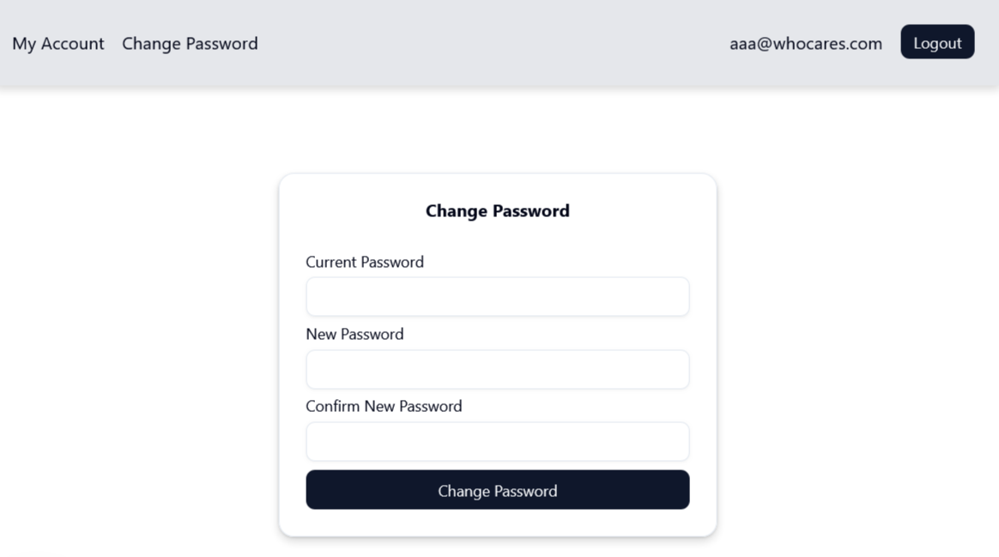

1. [Overview](#overview)
2. [Step 1: Create Page Receiving the Token](#step-1-create-page-receiving-the-token)
3. [Step 2: Retrieve Token and Validate Expiry](#step-2-retrieve-token-and-validate-expiry)
4. [Step 3: Create Form to Reset Password](#step-3-create-form-to-reset-password)
5. [Step 4: Update Password](#step-4-update-password)

---
# Overview
The functionality provides a page and form as a way to receive the password token via a request URL parameter and then to confirm the token. Here it assumes the request URL is in the email sent to the user and the user followed it to this page for the reset using the token.

**Note**: *It does not include the logic to send the email. The app pages are located in the `@/app/(logged-out)/update-password` directories.*

The development steps here will follow these steps. 

1. Create the page receving the token.
2. Retrieve the token and validate Expiry.
3. Create the form to validate that will validate the token and reset the password.
4. Update password and redirect the user

# Step 1: Create Page Receiving the Token 
The app page that receives a password reset token from the email will validate the token is still valid and if so, then redirect the user to a form to reset the password. 

- It will use the token to access the `passwordResetTokens` table and return the email address. If the token has expired then a message will display that otherwise the password reset form will be provided. 
- If valid then provide form to reset the password.

**Note**: *The client page in its entirety is provided below, with notes after to describe key steps.*

**source file**: *@/app/(logged-out)/update-password/page.tsx* 

```tsx
import { Card, CardContent, CardDescription, CardHeader, CardTitle } from "@/components/ui/card";
import { getPasswordToken } from "@/db/queries-passwordResetTokens";
import Link from "next/link";
import UpdateResetPasswordForm from "./update-password-form";

export default async function UpdateResetPassword({ searchParams }: {
  /* Note 1 */
  searchParams: Promise<{
    token?: string;
  }>
}) {
  const { token } = await searchParams;
  let isValidExpiry;
  let email;
  if (token) {
    /* Note 2 */
    const result = await getPasswordToken({ token });
    if (result.error) {
      console.log('Error occurred retrieving passwordToken');
    }

    isValidExpiry = result.isValidExpiry;
    email = result.email;
  }

  /* Note 3 */
  return (
    <main className="flex justify-center items-center min-h-screen">
      <Card className="w-[350]">
        <CardHeader>
          <CardTitle>Password Reset Update</CardTitle>
          <CardDescription>
            { isValidExpiry
              ? `${ email }`
              : "Your password reset link is invalid or has expired"
            }
          </CardDescription>
        </CardHeader>
        <CardContent>
          { isValidExpiry
            ? <UpdateResetPasswordForm userEmail={ email as string } />
            : <Link href='/password-reset' className="underline">
              Request another password Reset
            </Link>
          }
        </CardContent>
      </Card>
    </main>
  )
}
```
**Notes**:

  - **Note 1**: The request URL will contain a `token` parameter which will be the password token contained in the reset password email (not documented yet).
  - **Note 2**: Retrieve the token from the resetPasswordTokens table. The server request will return a boolean as to whether it was found and whether it has expired or not.
  - **Note 3**: Display either the form (if the token is still valid) or a message the token is not valid.

# Step 2: Retrieve Token and Validate Expiry
The `getPasswordToken` function accesses the `passwordResetTokens` table to retrieve the password token expiry and return a boolean that it is valid or not. 

  **Note**: *Notice in the code below the use of types as a means to provide good type safety (and documentation).*

  **source file** *@/db/queries-passwordResetTokens.ts*

  ```tsx
    /* Note 1 */
    export type PasswordTokenRecordType = {
      token: string;
    }

    type GetPasswordTokenReturnType = {
      error: boolean,
      message?: string,
      email?: string,
      tokenExpiry?: Date,
      isValidExpiry?: boolean
    }

    export async function getPasswordToken(arg: PasswordTokenRecordType)
    : Promise<GetPasswordTokenReturnType> {
        /* Note 2 */
        const [passwordResetToken] = await db
          .select()
          .from(passwordResetTokens)
          .where(eq(passwordResetTokens.token,arg.token));

          if (!passwordResetToken) {
            return {
              error: true,
              message: "Did not find token"
            }
          };

          let isValid: boolean=false;
          let validEmail;
          const now = Date.now();
          /* Note 3 */
          if (!!passwordResetToken.tokenExpiry && now < passwordResetToken.tokenExpiry.getTime()) {
            isValid=true;
            // console.log('getPasswordToken=>userId: ', passwordResetToken.userId);
            const result = await getEmailByUserId(passwordResetToken.userId);
            if (!result.success) {
              return {
                error: false,
                message: "Did not find id in users table"
              };
            };
            validEmail=result.email;
          }
          
          return {
            error: false,
            email: validEmail,
            tokenExpiry: passwordResetToken.tokenExpiry as Date,
            isValidExpiry: isValid
          }
    }
  ```
**Notes**:

  - **Note 1**: A good practice when using typescript are to use types (or interfaces) to provide the schema. In this case, both input and output types are in use.
  - **Note 2**: Query the `passwordResetTokens` table by token that was provided in the email.
  - **Note 3**: Return email address and a `isValidExpiry` boolean set to whether the token is still valid.

# Step 3: Create Form to Reset Password
The form submission will update the user password. As shown below, the form requires the current password, new password and new password confirmation elements.  



  **source file** *@/app/(logged-out)/update-password/update-password-form/index.tsx*

  ```tsx
    ...
    /* Note 1 */
    export default function UpdateResetPasswordForm({ userEmail }: UserEmailProp) {
      /* Note 2 */
      const [submitted, setSubmitted] = useState(false);

      const form = useForm<z.infer<typeof formSchema>>({
        resolver: zodResolver(formSchema),
        defaultValues: {
          password: "",
          passwordConfirm: ""
        }
      });

      /* Note 3 */
      const handleSubmit = async (data: z.infer<typeof formSchema>) => {
        setSubmitted(false);
        const response = await updateResetPassword({
          email: userEmail,
          password: data.password,
          passwordConfirm: data.passwordConfirm
        });

        if (response?.error) {
          form.setError("root", {
            message: response?.message,
          });
        }
        setSubmitted(true);
      };

      if (submitted) {
        return (
          <main>
            <CardContent className="flex-col gap-1">
              <p className="text-sm">Password reset was successful.</p>
              <div className="text-muted-foreground text-sm">
                Login to your account?{ " " }
                <Link href="/login" className="underline">
                  Login
                </Link>
              </div>
            </CardContent>
          </main>
        )
      };

      /* Note 4 */
      return (
        <Form { ...form }>
          <form onSubmit={ form.handleSubmit(handleSubmit) }>
            <fieldset disabled={ form.formState.isSubmitting } className="flex flex-col gap-2">
              <FormField
                control={ form.control }
                name="password"
                render={ ({ field }) => (
                  <FormItem>
                    <FormLabel>New Password</FormLabel>
                    <FormControl>
                      <Input { ...field } type="password" />
                    </FormControl>
                    <FormMessage />
                  </FormItem>
                ) }
              />
              <FormField
                control={ form.control }
                name="passwordConfirm"
                render={ ({ field }) => (
                  <FormItem>
                    <FormLabel>Confirm New Password</FormLabel>
                    <FormControl>
                      <Input { ...field } type="password" />
                    </FormControl>
                    <FormMessage />
                  </FormItem>
                ) }
              />
              { !!form.formState.errors.root?.message &&
                <FormMessage>
                  { form.formState.errors.root.message }
                </FormMessage>
              }
              <Button type="submit">Update Password</Button>
            </fieldset>
          </form>
        </Form>
      )
    }
  ```
**Notes**:

  - **Note 1**: *The `email` address is passed into this *client* component from the `page.tsx` which gets the email from the token processed there.*
  - **Note 2**: *A state variable (`submitted`) is in use because the `form.formState.isSubmitSuccessful` was not working for me. It's a client component anyway, so that's OK.*
  - **Note 3**: *The `handleSubmit` function will initate the `updateResetPassword` server function to change the  password.*
  - **Note 4**: *If the form was submitted successfully, without any issues then render a link to the login page.Otherwise, render the password update form.*

# Step 4: Update Password 
The server-side actions component for this form implements the `updateResetPassword` server function called from the `handleSubmit` event.

  **source file** *@/app/(logged-out)/update-password/update-password-form/action.ts*

  ```tsx
    ...
    export const updateResetPassword = async({
      email,
      password, 
      passwordConfirm}: {
        email: string, 
        password: string, 
        passwordConfirm: string
        }
      ) => { 
        /* Note 1 */
        const session = await auth();
        if (session?.user?.id) {
          return {
            error: true,
            message: "Already logged in. Please logout to reset your password."        
          }
        }
        try {
          console.info('updateResetPassword->starting->email: ', 
            email, 'password: ', 
            password, 'passwordConfirm: ', 
            passwordConfirm);

          const formSchema = z.object({
            password: passwordSchema
          }).and(passwordMatchSchema);
          
          /* Note 2 */
          const passwordValidation = formSchema.safeParse({password, passwordConfirm});
          if (!passwordValidation.success) {
            return {
              error: true,
              message: passwordValidation.error.issues[0]?.message ?? "An error occurred",
            };
          };
          /* Note 3 */
          const getReturn = await getUserByEmail(email);
          if (!getReturn.success) {
            return {
              error: true,
              message: 'Issue finding account'
            }
          }
          /* Note 4 */
          const updateReturn = await updateUserPassword(email, password);
          if (updateReturn.error) {
            return updateReturn;
          }
          /* Note 5 */
          const removeReturn = await removePasswordToken(getReturn.id as number)
          if (removeReturn.error) {
            return removeReturn;
          }
          return {
            error:false,
          };
        } catch (e: unknown) {
          if (e instanceof Error && e.code === "23505") {
            return {
              error: true,
              message: "An account is already registered with that email"
            };
          }
          return {
            error: true,
            message: "An unknown error occured."
          }
        }    
      };
  ```

**Notes**:

  - **Note 1**: *As a precaution, check if a session already exists. If it does then return an error that will be surfaced Update password page.*
  - **Note 2**: *Validate the input schema (**passwords match**) using `safeParse` which does not throw an error.*
  - **Note 3**: *Confirm user details in the `users` table (again, precautionary)*
  - **Note 4**: *Update the password on the `users` table. This function will *generate another salt guid* and hash the new password according to that salt. (Both values are stored in the password column, separate by a colon "`:`".)*
  - **Note 5**: *The password reset token is removed from the table, so if the password reset in the URL of page.tsx should run again, it would result in an error and not another update.*
