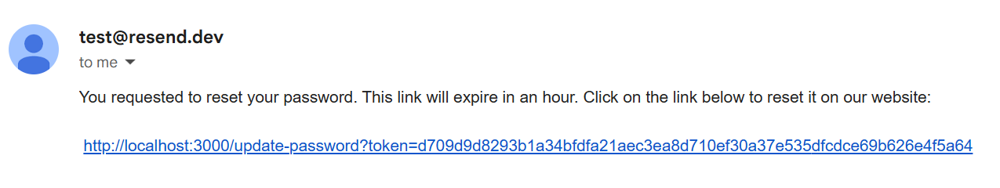

1. [Overview](#overview)
2. [Step 1: Setup resend.com Account](#step-1-setup-resendcom-account)
3. [Step 2: Install Node Mailer Module](#step-2-install-node-mailer-module)
4. [Step 3: Configure Helper Function to Initialize Transport](#step-3-configure-helper-function-to-initialize-transport)
5. [Step 4: Add sendEmail to Server Action](#step-4-add-sendemail-to-server-action)
6. [Step 5: Test the Reset Password End-to-End](#step-5-test-the-reset-password-end-to-end)

---

# Overview
The functionality in this markdown documents sending the email. (See the [markdown index](../README-HowToGuides.md) for a list of the How-To documents and their purpose.)

Traditionally an SMTP server would need to be set up but in our cloud environment we'll use the [resend.com](https://resend.com/pricing) cloud service to do this. In resend.com, there are two ways to send email: via their REST APIs or SMTP. Although the former is likely more often utilized by developers, using the SMTP interface can be transferred to different vendors providing this class of service (e.g. Resend, Bravo, SendGrid).

The functionality here will follow these steps. 

1. Sign up for a developer account at resend.com.
2. Install NodeMailer in the project.
3. Configure a helper function to initialize SMTP transport.
4. Create a server function to send the email.
5. Test the entire reset password end-to-end.

# Step 1: Setup resend.com Account
No big deal here, on the resend.com site simply provide your email address and a password. 

- You'll then be send an email to confirm the account. Do so and then you'll be directed to the login page. 
- There will be no need to create a domain as the test server will be used. 
- Don't create an API token until you follow that step below.

# Step 2: Install Node Mailer Module
1. In a terminal run: `npm i nodemailer`
2. Install the typescript types: `npm i --save-dev @types/nodemailer`

# Step 3: Configure Helper Function to Initialize Transport
Documentation on how to configure SMTP for a resend [can be found here](https://resend.com/settings/smtp). (The values below can be copied from this page.)

1. Go to [resend.com site](https://resend.com/docs/send-with-nodemailer-smtp) and create an API key. Copy the value to your clipboard!

2. Paste the API key value to the `@/env.local` file as RESEND_API_KEY property.

    ```bash
    ...
    RESEND_API_KEY="re_aBuMBPbq_JwfdMXzCiqxsDbi5WZFtoZZ4" 
    ```
3. A helper function to instantiate the nodemailer functionality appears below. 

    **source file**: *@/lib/emails.ts*

    ```tsx
      import nodemailer from 'nodemailer';
      import { SentMessageInfo } from 'nodemailer';

      export const mailer: nodemailer.Transporter<SentMessageInfo> = nodemailer.createTransport({
        host: 'smtp.resend.com',
        port: 587,
        auth: {
          user: 'resend',
          pass: process.env.RESEND_API_KEY,
        }
      });
    ```

**Notes**: 

- The transport configuration object contains properties you can get from the resend.com site but the one's shown below are for the test email server.
- The `SentMessageInfo` type referenced above provides a usable type that can be checked in the sendMail function, described further below.

# Step 4: Add sendEmail to Server Action
 In this step code will be added to the `@/app/(logged-out)/password-reset/reset-password-form/actions.ts` file that created the password reset token, to send the email using the above helper function.

 1. Again, update the `@/env.local` to add the site URL shown below: 

    ```bash
    SITE_BASE_URL="http://localhost:3000" 
    ```
 2. The code snippet shown below uses the nodemailer helper and is added right after the token record is inserted into the `passwordResetTokens` table.

    **source file**: *@/app/(logged-out)/password-reset/reset-password-form/actions* 
    
    ```tsx
    ...
      const result = await insertPasswordToken(insertRecord);

      const resetLink=`${process.env.SITE_BASE_URL}/update-password?token=${token}`
        const sendResult = await mailer.sendMail({
        from: "test@resend.dev",
        subject: "Your Password Reset Request",
        to: email,
        text: `You requested to reset your password. This link will expire in an hour. Click on the link below to reset it on our website:\n\n ${resetLink}`,
      });

      if (!sendResult.accepted) {
        return {
          error: true,
          message: "Reset Password email did not send"
        }
      }

      return {
        error: false,
      }
    ```

**Note**: The `sendResult.accepted` property is an array of emails.

# Step 5: Test the Reset Password End-to-End
Whatever email you used to register in the resend.com website will need to be the email address you will need to use in your test of the send email functionality. (This is due to the test server being used here.)

1. Register resend.com email address in the app, i.e. `http://localhost:3000/register`.
2. On the your account has been created page, click on the button to `Login to your account`.
3. On the login page select the `Reset my password` link.
4. On the Password Reset page enter the resend.com email address and click on the submit button.
5. Open your email client, find the email (might take a minute or so), and click on the link at the end of the email.

    

6. In the Password Reset Update page enter the new password and confirmation.  (The password can be the old one, there's no check for this.)
7. After resetting the password, the next page will provide a link to login. Do so and verify your new password.
