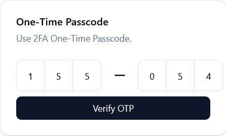

# Overview

The previous [How-To guide](./HOWTO-7-TwoFactorAuth.md) covered providing a user with two-factor authentication. Now that 2FA is added to the project all that remains is to update the login process to use it. It's pretty involved, so there's an overview below.

When a user with 2FA enabled logs in, there are two separate logins occurring, one for the email/credentials and the other for the OTP.
1. Validate email and password credentials (this user has 2FA enabled)

    

2. Once validated, then render a 2nd login form to capture the OTP.

    

Once the OTP is validated then redirect the user to the "my-account" page.


The development steps for this How-To guide are summarized below.

1. Add a 2nd step in the LoginForm to render the OTP input component.
2. Add an event handler for the 2nd step form submission to validate the OTP.

# Step 1: Add OTP Input Step to Login Form
In the prior How-To guide that documented the login form, the 2nd step was left off the code snippet so it could be covered here. The time has come.

**source file**: *`@app/(auth)/(logged-out)/login/login-form/index.tsx`*

```tsx
  ...
  /* NOTE 1 */
  const handle2faSubmit = async (e: React.FormEvent<HTMLFormElement>) => {
    e.preventDefault();
    const validateOtpRecord: ValidateOtpRecordType = { email: email, token: otp };
    
    const loginResult = await fullLoginUser({ email: email, password: form.getValues("password"), token: otp })
    
    if (loginResult?.error) {
      setOtpError(loginResult.message as string);
    }
    else {
      router.push('my-account');
    };
  };
  ...
  return (
    <main className="flex justify-center items-center min-h-screen">
    ...
    {"NOTE 2"}
      { step === 2 && (
        <Card className="w-[350]">
          <CardHeader>
            <CardTitle>One-Time Passcode</CardTitle>
            <CardDescription>Use 2FA One-Time Passcode.</CardDescription>
          </CardHeader>
          <CardContent>
            <form onSubmit={ handle2faSubmit } className="flex flex-col gap-2">
              {"NOTE 3"}
              <InputOTP maxLength={ 6 } value={ otp } onChange={ setOtp }>
                <InputOTPGroup className="*:data-[slot=input-otp-slot]:h-12 *:data-[slot=input-otp-slot]:w-11 *:data-[slot=input-otp-slot]:text-xm">
                  <InputOTPSlot index={ 0 } />
                  <InputOTPSlot index={ 1 } />
                  <InputOTPSlot index={ 2 } />
                </InputOTPGroup>
                <InputOTPSeparator className="mx-2" />
                <InputOTPGroup className="*:data-[slot=input-otp-slot]:h-12 *:data-[slot=input-otp-slot]:w-11 *:data-[slot=input-otp-slot]:text-xm">
                  <InputOTPSlot index={ 3 } />
                  <InputOTPSlot index={ 4 } />
                  <InputOTPSlot index={ 5 } />
                </InputOTPGroup>
              </InputOTP>
              { otpError &&
                <div>
                  <p className="text-sm text-red-600 text-center">{ otpError }</p>
                </div>
              }
              {"NOTE 4"}
              <Button disabled={ otp.length !== 6 } type="submit">Verify OTP</Button>
            </form>
          </CardContent>
        </Card>
      ) }
    </main>
```
**Notes**: 

  - **Note 1**: *The `handle2faSubmit` event handles the OTP input submission in Step 2.*
  - **Note 2**: *The first step was truncated from snippet, to focus on the 2nd step form. It renders the shadcn `input-otp` component.*
  - **Note 3**: *React state variable `otp` is being used capture the OTP, in the `onChange` event.*
  - **Note 4**: *The Verify OTP button is disabled until all 6 digits of the OTP are entered.*

# Step 2: Add OTP Input Submit Event Handler